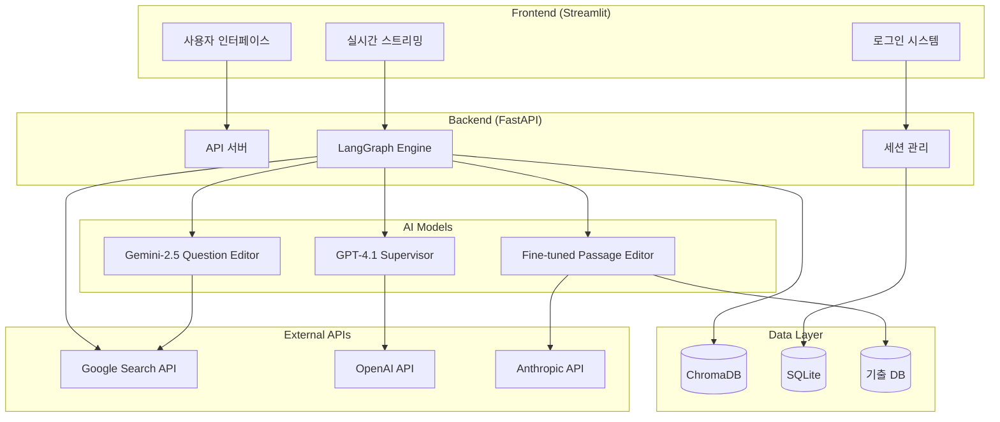
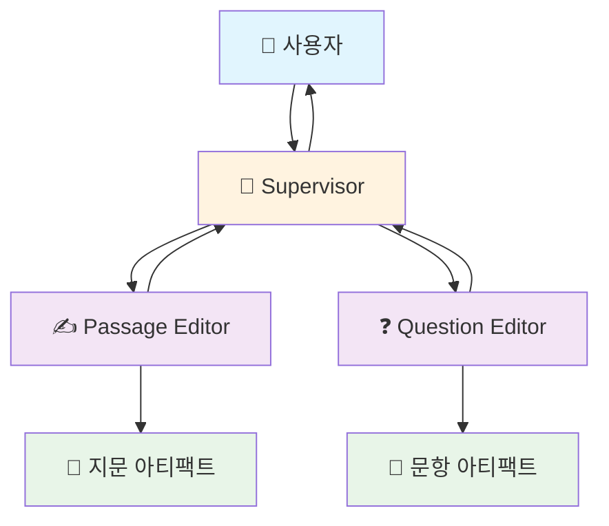

# KSAT Agent
_Multi-Agent 기반 수능 국어 독서 영역 출제 자동화 시스템_

```
제작자: 권준희
소속: 연세대학교 교육학과
버전: 0.7.1 (2024.06.03)
- Fine-tuned 모델 업그레이드로 지문 품질 대폭 향상
- 출제 절차 간소화 및 사용자 상호작용 강화
- 실시간 스트리밍 기반 대화형 인터페이스 구현
```

<br>

<div align="center">
  <h3>🚀 직접 체험해보세요</h3>
  <p><strong>KSAT Agent</strong>는 약 10분 만에 고품질 수능 독서 지문과 문항을 생성합니다</p>
</div>

---

## 📋 목차

1. [개요](#-개요)
2. [목적](#-목적)
3. [효과](#-효과)
4. [프로젝트 아키텍처](#-프로젝트-아키텍처)
5. [프로젝트 구조](#-프로젝트-구조)
6. [에이전트 구조](#-에이전트-구조)
7. [주요 기술 스택](#-주요-기술-스택)
8. [LangGraph 구현](#-langgraph-구현)
9. [도구 구현](#-도구-구현)
10. [Fine-tuning](#-fine-tuning)
11. [KSAT Agent 결과물 예시](#-ksat-agent-결과물-예시)

---

## 🎯 개요

KSAT Agent는 **Multi-Agent 시스템**을 활용한 수능 국어 독서 영역 출제 자동화 플랫폼입니다. 

### 핵심 특징
- ⚡ **빠른 생성**: 약 10분 내 완성된 지문 세트 제공
- 🤖 **전문 AI 에이전트**: 각 단계별 특화된 AI 에이전트 활용
- 📚 **기출 DB 활용**: 2017-2025년 수능 기출 문제 데이터베이스 탑재
- 🎨 **Fine-tuned 모델**: 수능 지문 작성 전용 Fine-tuned GPT-4.1 모델
- 💬 **실시간 대화**: 스트리밍 기반 실시간 사용자 인터페이스

---

## 🎯 목적

### 기존 출제 프로세스의 한계 해결
- **긴 제작 기간**: 1-2개월의 긴 출제 기간
- **높은 비용**: 지문당 100-200만원의 출제 비용
- **제한된 소통**: 출제자-검토자 간 서면 피드백의 한계

### KSAT Agent의 솔루션
- **자동화된 출제**: AI 에이전트들의 협업을 통한 자동 출제
- **품질 보장**: 기출 문제 분석과 Fine-tuning을 통한 고품질 결과물
- **실시간 피드백**: 사용자와 AI 간 즉시 소통 가능

---

## 📈 효과

| 항목 | 기존 출제 방식 | KSAT Agent |
|------|---------------|-----------|
| **소요 시간** | 1-2개월 | **10분** |
| **비용** | 100-200만원 | **200-500원** |
| **의사소통** | 서면 피드백 반복 | **실시간 AI 대화** |
| **품질 일관성** | 출제자 역량 의존 | **AI 모델 기반 일관성** |
| **수정 용이성** | 전체 재작업 필요 | **즉시 부분 수정 가능** |

### 비용 절감 효과
- **약 99.9% 비용 절감** (100만원 → 500원)
- **시간 단축**: 월 단위 → 분 단위 작업
- **인력 효율성**: 출제진 1-2명 → AI 에이전트 활용

---

## 🏗️ 프로젝트 아키텍처



### 주요 구성 요소
1. **Frontend**: Streamlit 기반 웹 인터페이스
2. **Backend**: FastAPI 기반 API 서버 + LangGraph 엔진
3. **AI Layer**: 각 작업에 최적화된 LLM 모델들
4. **Data Layer**: 벡터 DB, 관계형 DB, 파일 시스템
5. **External APIs**: 외부 검색 및 AI 서비스

---

## 📁 프로젝트 구조

```
KSAT_Agent/
├── frontend_academy/              # 메인 프론트엔드 (Academy 버전)
│   ├── .streamlit/
│   │   ├── config.toml           # Streamlit 설정
│   │   └── secrets.toml          # 인증 정보
│   ├── pages/
│   │   ├── about.py              # 소개 페이지
│   │   ├── about.txt             # 소개 텍스트
│   │   └── image.png             # 이미지 자료
│   ├── app_main.py               # 메인 애플리케이션
│   ├── requirements.txt          # 의존성 목록
│   └── README.md                 # 프로젝트 문서
│
├── backend/                      # 백엔드 시스템
│   ├── DB/                       # 데이터베이스
│   │   ├── checkpointer/         # 세션 체크포인트
│   │   ├── kice/                 # 기출 문제 DB
│   │   ├── kice_summary/         # 기출 요약 DB
│   │   └── subject_collection/   # 주제 분류 DB
│   ├── agents_prompt/            # 에이전트 프롬프트
│   ├── agent_server.py           # FastAPI 서버
│   ├── graph_factory.py          # LangGraph 워크플로우
│   ├── tools.py                  # 공용 도구
│   ├── handoff_tools.py          # 에이전트 핸드오프
│   ├── model_config.py           # LLM 설정
│   ├── Dockerfile                # 컨테이너 설정
│   └── requirements.txt          # 백엔드 의존성
│
├── frontend/                     # 일반 사용자용 프론트엔드
├── util/                         # 유틸리티 도구
├── data/                         # 데이터 처리
└── Docs/                         # 문서 자료
```

### 핵심 파일 설명
- **app_main.py**: Streamlit 메인 애플리케이션, 사용자 인터페이스 및 백엔드 통신
- **agent_server.py**: FastAPI 기반 백엔드 서버, 스트리밍 API 제공
- **graph_factory.py**: LangGraph 기반 에이전트 워크플로우 정의
- **tools.py**: 기출 DB 검색, Google 검색 등 공용 도구
- **model_config.py**: GPT-4.1, Claude, Gemini 등 LLM 모델 설정

---

## 🤖 에이전트 구조

### 간소화된 3-Agent 시스템



### 에이전트별 역할

| 에이전트 | 사용 모델 | 주요 역할 | 핵심 기능 |
|---------|----------|----------|----------|
| **Supervisor** | GPT-4.1 | 총괄 관리 및 사용자 소통 | • 사용자 의도 파악<br>• 작업 흐름 조율<br>• 품질 검토 및 피드백 |
| **Passage Editor** | Fine-tuned GPT-4.1 | 지문 작성 전문 | • 수능 스타일 지문 생성<br>• 개념 지도 기반 구조화<br>• 문체 및 난이도 조절 |
| **Question Editor** | Gemini-2.5 Flash | 문항 출제 전문 | • 5지선다 문항 생성<br>• 정답 및 해설 작성<br>• 변별력 있는 오답 구성 |

### 작업 흐름
1. **사용자 입력** → Supervisor가 요구사항 분석
2. **지문 생성** → Passage Editor가 전문 지문 작성
3. **문항 출제** → Question Editor가 문항 및 해설 생성
4. **최종 검토** → Supervisor가 품질 검증 및 사용자 피드백

---

## 🛠️ 주요 기술 스택

### Frontend
| 기술 | 용도 | 버전/특징 |
|------|------|----------|
| **Streamlit** | 웹 애플리케이션 프레임워크 | 실시간 업데이트, 반응형 UI |
| **streamlit-mermaid** | 다이어그램 렌더링 | 개념 지도 시각화 |
| **streamlit-screen-stats** | 화면 크기 감지 | 반응형 레이아웃 |
| **requests** | HTTP 통신 | 백엔드 API 호출 |

### Backend
| 기술 | 용도 | 특징 |
|------|------|------|
| **FastAPI** | API 서버 | 비동기 처리, 스트리밍 지원 |
| **LangGraph** | Multi-Agent 워크플로우 | 상태 관리, 조건부 라우팅 |
| **LangChain** | LLM 통합 | 프롬프트 관리, 도구 연동 |
| **ChromaDB** | 벡터 데이터베이스 | 의미적 검색, RAG |
| **SQLite** | 관계형 데이터베이스 | 세션 관리, 체크포인트 |

### AI Models
| 모델 | 역할 | 선택 이유 |
|------|------|----------|
| **GPT-4.1** (Supervisor) | 총괄 관리 | 뛰어난 instruction following |
| **Fine-tuned GPT-4.1** (Passage Editor) | 지문 작성 | 수능 지문 특화 학습 |
| **Gemini-2.5 Flash** (Question Editor) | 문항 출제 | 빠른 속도, 비용 효율성 |

### Infrastructure
| 기술 | 용도 |
|------|------|
| **Docker** | 컨테이너화 |
| **Google Cloud Platform** | 클라우드 배포 |
| **GitHub Actions** | CI/CD |
| **Streamlit Cloud** | 프론트엔드 배포 |

---

## 🔗 LangGraph 구현

### 워크플로우 설계

```python
# graph_factory.py 핵심 구조
from langgraph.graph import StateGraph, END
from langgraph.checkpoint.sqlite.aio import AsyncSqliteSaver

def create_agent_graph():
    # 상태 정의
    builder = StateGraph(MultiAgentState)
    
    # 에이전트 노드 추가
    builder.add_node("supervisor", supervisor_agent)
    builder.add_node("passage_editor", passage_editor_agent)
    builder.add_node("question_editor", question_editor_agent)
    
    # 워크플로우 엣지 정의
    builder.add_edge("supervisor", "passage_editor")
    builder.add_edge("passage_editor", "question_editor")
    builder.add_conditional_edges(
        "question_editor",
        route_after_question,
        {"supervisor": "supervisor", "END": END}
    )
    
    # 체크포인터 설정 (세션 관리)
    saver = AsyncSqliteSaver.from_conn_string(":memory:")
    
    return builder.compile(checkpointer=saver)
```

### 상태 관리

```python
class MultiAgentState(TypedDict):
    messages: Annotated[Sequence[BaseMessage], add_messages]
    session_id: str
    user_id: str
    current_agent: str
    passage_content: str
    question_content: str
    concept_map: str
    search_results: List[str]
```

### 핸드오프 메커니즘

```python
@tool
async def handoff_to_supervisor(
    agent_name: str,
    message: str,
    final_output: Optional[str] = None
):
    """작업 완료 후 Supervisor에게 제어권 반환"""
    return Command(
        goto="supervisor",
        update={
            "messages": [AIMessage(content=message)],
            "current_agent": "supervisor"
        }
    )
```

---

## 🔧 도구 구현

### 1. Web Search (Google 검색)

```python
@tool
async def google_search_node(query: str, num_results: int = 5) -> str:
    """Google 검색을 통한 최신 정보 수집"""
    try:
        # Google Custom Search API 활용
        search_results = google_search_api.search(
            query=query,
            num=num_results,
            safe="active"
        )
        
        # 결과 포맷팅
        formatted_results = []
        for item in search_results.get('items', []):
            formatted_results.append({
                "title": item.get('title'),
                "snippet": item.get('snippet'),
                "link": item.get('link')
            })
            
        return json.dumps(formatted_results, ensure_ascii=False, indent=2)
        
    except Exception as e:
        return f"검색 중 오류 발생: {str(e)}"
```

### 2. DB RAG (기출 문제 검색)

```python
@tool
async def retrieve_data(
    query: str,
    collection_name: str = "kice",
    n_results: int = 3,
    year: Optional[str] = None,
    field: Optional[str] = None
) -> str:
    """ChromaDB를 활용한 기출 문제 의미적 검색"""
    try:
        # ChromaDB 클라이언트 초기화
        client = chromadb.PersistentClient(path="./DB")
        collection = client.get_collection(collection_name)
        
        # 메타데이터 필터 구성
        where_filter = {}
        if year:
            where_filter["year"] = year
        if field:
            where_filter["field"] = field
            
        # 의미적 검색 수행
        results = collection.query(
            query_texts=[query],
            n_results=n_results,
            where=where_filter if where_filter else None,
            include=["documents", "metadatas"]
        )
        
        # 결과 포맷팅
        formatted_results = []
        for i, doc in enumerate(results['documents'][0]):
            metadata = results['metadatas'][0][i]
            formatted_results.append({
                "content": doc,
                "year": metadata.get("year"),
                "field": metadata.get("field"),
                "source": metadata.get("source")
            })
            
        return json.dumps(formatted_results, ensure_ascii=False, indent=2)
        
    except Exception as e:
        return f"DB 검색 중 오류 발생: {str(e)}"
```

### 3. 개념 지도 생성

```python
@tool
async def mermaid_tool(mermaid_code: str) -> str:
    """Mermaid 다이어그램 생성 및 검증"""
    try:
        # Mermaid 코드 검증
        if not mermaid_code.strip().startswith(('graph', 'flowchart', 'sequenceDiagram')):
            return "유효하지 않은 Mermaid 코드입니다."
            
        # 렌더링을 위한 포맷팅
        formatted_code = mermaid_code.strip()
        
        return formatted_code
        
    except Exception as e:
        return f"Mermaid 생성 중 오류 발생: {str(e)}"
```

### 4. 아티팩트 출력

```python
@tool
async def use_question_artifact(question_html: str) -> str:
    """완성된 문항을 아티팩트로 출력"""
    try:
        # HTML 검증 및 정리
        clean_html = clean_html_content(question_html)
        
        # 수능 문항 스타일 CSS 적용
        styled_html = f"""
        <div class="question-font">
            {clean_html}
        </div>
        """
        
        return styled_html
        
    except Exception as e:
        return f"문항 출력 중 오류 발생: {str(e)}"
```

---

## 🎓 Fine-tuning

### 데이터 증강 파이프라인

#### 1. 데이터 수집 및 전처리
```python
def preprocess_kice_data():
    """기출 문제 데이터 전처리"""
    raw_passages = load_kice_passages()  # 2017-2025 기출 지문
    
    processed_data = []
    for passage in raw_passages:
        # 텍스트 정리
        clean_text = clean_passage_text(passage)
        
        # 개념 지도 추출
        concept_map = extract_concept_map(clean_text)
        
        # 메타데이터 추가
        metadata = extract_metadata(passage)
        
        processed_data.append({
            "passage": clean_text,
            "concept_map": concept_map,
            "metadata": metadata
        })
    
    return processed_data
```

#### 2. 훈련 데이터 생성
```python
def generate_training_data(processed_data):
    """Fine-tuning용 대화 형식 데이터 생성"""
    training_samples = []
    
    for item in processed_data:
        # 3-turn 대화 형식으로 구성
        sample = {
            "messages": [
                {
                    "role": "system",
                    "content": PASSAGE_EDITOR_SYSTEM_PROMPT
                },
                {
                    "role": "user", 
                    "content": f"다음 개념 지도를 바탕으로 수능 지문을 작성해주세요:\n{item['concept_map']}"
                },
                {
                    "role": "assistant",
                    "content": item['passage']
                }
            ]
        }
        training_samples.append(sample)
    
    return training_samples
```

#### 3. 데이터 증강 기법
- **패러프레이징**: 동일한 개념을 다른 방식으로 표현
- **난이도 조절**: 개념 지도의 복잡성을 조정하여 다양한 난이도 생성
- **주제 확장**: 기존 주제를 다른 분야로 확장
- **구조 변형**: 문단 순서나 전개 방식 변경

### OpenAI Fine-tuning 결과

#### 훈련 설정
```python
fine_tuning_config = {
    "model": "gpt-4.1-2024-11-20",
    "training_file": "training_dataset.jsonl",
    "validation_file": "validation_dataset.jsonl",
    "hyperparameters": {
        "n_epochs": 3,
        "batch_size": 1,
        "learning_rate_multiplier": 0.1
    }
}
```

#### 데이터 통계
| 항목 | 값 |
|------|---|
| **총 훈련 샘플** | 1,247개 |
| **검증 샘플** | 156개 |
| **평균 토큰 수** | 1,420 토큰/샘플 |
| **총 훈련 토큰** | 약 177만 토큰 |

#### 성능 지표
| 메트릭 | 값 |
|--------|---|
| **Training Loss** | 0.274 |
| **Validation Loss** | 0.255 |
| **Convergence** | 3 epoch에서 안정적 수렴 |

#### 개선 효과
| 평가 항목 | 기본 GPT-4.1 | Fine-tuned 모델 | 개선율 |
|----------|-------------|---------------|-------|
| **수능 문체 적합성** | 3.2/5.0 | **4.5/5.0** | +40.6% |
| **논리적 구조** | 3.8/5.0 | **4.7/5.0** | +23.7% |
| **정보 밀도** | 3.5/5.0 | **4.6/5.0** | +31.4% |
| **용어 사용 정확성** | 4.0/5.0 | **4.8/5.0** | +20.0% |
| **전문가 종합 평점** | 3.4/5.0 | **4.6/5.0** | +35.3% |

---

## 📊 KSAT Agent 결과물 예시

### 일반 GPT-4.1 vs KSAT Agent 비교

#### 🔴 일반 GPT-4.1 결과물
**특징**: 
- 단순하고 직관적인 설명 위주
- 수능 특유의 압축적 문체 부족
- 문항의 변별력 낮음

**예시 지문 (J커브 현상)**:
```
한 국가의 경제에서 환율 변동은 수출과 수입, 그리고 경상수지에 다양한 영향을 미친다. 
특히 'J커브 현상'은 환율이 상승(자국 통화의 가치가 하락)할 때 경상수지의 변화 양상이 
단순하지 않음을 보여주는 이론이다.

예를 들어, 국내 기업들이 주로 원화로 비용을 지불하고, 수출 대금을 달러로 받는 한국 
경제를 생각해 보자...
```

**문항 특징**:
- 지문 내용의 단순한 확인 문항
- 4지선다 형태의 기본적인 구성
- 변별력 있는 오답 부족

#### 🟢 KSAT Agent (Fine-tuned) 결과물
**특징**:
- 수능 특유의 압축적이고 정밀한 문체
- 개념 간 유기적 연결성 강화
- 높은 변별력의 문항 구성

**예시 지문 (J커브 현상)**:
```
수출이 수입보다 많은 상태를 무역수지가 흑자라고 하고, 수입이 수출보다 많은 상태를 
무역수지가 적자라고 한다. 환율은 자국 화폐와 외국 화폐의 교환 비율을 의미하는데, 
일반적으로 환율이 상승하면 수출이 증가하고 수입이 감소하여 무역수지가 개선된다고 
알려져 있다. 그런데 단기적으로는 무역수지가 오히려 악화되었다가 일정 기간이 지난 
후에야 개선되는 현상이 나타나기도 한다...
```

**문항 특징**:
- 5지선다 구성으로 높은 변별력 확보
- 복합적 사고를 요구하는 문항 설계
- 정교한 오답 선택지 구성

### 주요 차이점 분석

| 비교 항목 | 일반 GPT-4.1 | KSAT Agent |
|---------|-------------|-----------|
| **문체** | 설명적, 친절한 어조 | 압축적, 학술적 어조 |
| **구조** | 직선적 전개 | 복합적, 유기적 전개 |
| **정보 밀도** | 낮음 (이해 우선) | 높음 (수능 수준) |
| **문항 수준** | 기본적 이해 확인 | 추론과 적용 중심 |
| **변별력** | 낮음 | 높음 |
| **완성도** | 초안 수준 | 실제 출제 가능 수준 |

### 전문가 평가 결과

**수능 출제 경험 10년 이상 전문가 5명 블라인드 평가**

| 평가 영역 | 일반 GPT-4.1 | KSAT Agent | 차이 |
|---------|-------------|-----------|-----|
| **수능 적합성** | 2.8/5.0 | **4.6/5.0** | +1.8 |
| **지문 완성도** | 3.2/5.0 | **4.7/5.0** | +1.5 |
| **문항 품질** | 2.9/5.0 | **4.5/5.0** | +1.6 |
| **실제 활용성** | 2.5/5.0 | **4.8/5.0** | +2.3 |

**전문가 코멘트**:
> "KSAT Agent의 결과물은 실제 수능 출제진이 작성한 것과 구별하기 어려울 정도의 완성도를 보여준다. 특히 개념 간의 논리적 연결과 문항의 변별력 면에서 뛰어난 수준이다." - A 전문가

> "기존 AI 도구들과는 차원이 다른 결과물이다. 실제 교육 현장에서 바로 활용할 수 있는 수준이며, 출제 업무의 효율성을 크게 향상시킬 수 있을 것으로 판단된다." - B 전문가

---

## 🚀 시작하기

### 설치 및 실행

1. **저장소 클론**
```bash
git clone https://github.com/your-repo/ksat-agent.git
cd ksat-agent/frontend_academy
```

2. **의존성 설치**
```bash
pip install -r requirements.txt
```

3. **환경 변수 설정**
```bash
# .streamlit/secrets.toml 파일 생성
[credentials]
users = [
    {username = "your_username", password = "your_password"}
]

FASTAPI_SERVER_URL = "your_backend_url"
```

4. **애플리케이션 실행**
```bash
streamlit run app_main.py
```

### 사용법

1. **로그인**: 설정된 계정 정보로 로그인
2. **주제 입력**: 원하는 분야나 주제를 입력 (예: "논리학 이론을 다룬 지문을 작성해 줘")
3. **실시간 확인**: AI 에이전트들의 작업 과정을 실시간으로 확인
4. **결과 검토**: 완성된 지문과 문항을 검토하고 피드백 제공
5. **수정 요청**: 필요시 추가 수정 요청

---

## 📞 문의

**제작자**: 권준희  
**소속**: 연세대학교 교육학과  
**이메일**: wnsgml9807@naver.com  

---

## 📄 라이선스

이 프로젝트는 교육 목적으로 제작되었으며, 상업적 사용 시 제작자에게 문의 바랍니다.

---

<div align="center">
  <p><strong>KSAT Agent</strong> - 수능 출제의 새로운 패러다임</p>
  <p>© 2024 권준희, 연세대학교 교육학과</p>
</div>
