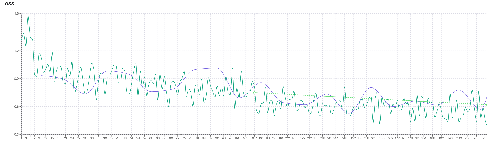

# KSAT Agent
_Multi-Agent 기반 수능 국어 독서 영역 출제 자동화 시스템_

```
제작자: 권준희
소속: 연세대학교 교육학과
버전: 0.7.1 (2024.06.03)
- Fine-tuned 모델 업그레이드로 지문 품질 대폭 향상
- 문항 구성 다양화, 오답 선지 고도화
- 출제 절차 간소화 및 사용자 상호작용 강화
```

<br>

<div align="center">
  <h3> 직접 사용해 보세요 ✨</h3>
  <a href="https://ksat-generator-kjh7207.streamlit.app/" target="_blank">
    
  </a>
  <p><i>버튼을 클릭하면 데모 앱 링크로 이동합니다. 🚀</i></p>
</div>
<br>


---

## 1️⃣ 프로젝트 개요

KSAT Agent는 수능 국어 모의고사 출제 업무를 AI로 자동화하는 시스템입니다. 
더 많은 학생들이 적은 비용으로 양질의 학습 콘텐츠를 누릴 수 있도록, AI 기반의 출제 시스템 개발을 시도하였습니다. 
대성학원, 메가스터디 등 대형 학원에서 3년간 국어 모의고사 출제자로 활동한 경험과 노하우를 시스템에 녹여내었으며, 이를 통해 교육 격차 해소에도 기여하고자 합니다.

---

## 2️⃣ 프로젝트 성과

| 항목 (지문 당) | 기존  | KSAT Agent 사용 시 |
|------|---------|--------------------|
| **소요 시간** | 1 ~ 2 개월 | **10 분** |
| **비용** | 100~200만 원 | **200~500 원** |
| **의사소통** | 서면 피드백 반복 | 실시간 AI 대화 |

- 기존 출제 프로세스 대비 비용과 출제 시간을 획기적으로 단축하면서도, 외주 출제자에 의존하던 비효율적인 구조를 크게 개선하였습니다.
- 퀄리티를 유지하면서도 누구나 쉽게 고품질 모의고사 콘텐츠를 제작할 수 있습니다.
- **강남대성수능연구소와 협업 논의가 진행 중입니다.**

---

## 3️⃣ 결과물 예시

<style>
@import url('https://fonts.googleapis.com/css2?family=Nanum+Myeongjo:wght@400;700;800&display=swap');
.passage-font {
    border: 0.5px solid black;
    border-radius: 0px;
    padding: 5px !important;
    margin-bottom: 20px;
    font-family: 'Nanum Myeongjo', serif !important;
    font-size: 11px !important;
    line-height: 1.7;
    letter-spacing: -0.01em;
    font-weight: 500;
}
.passage-font p {
    text-indent: 1em; /* 각 문단의 첫 줄 들여쓰기 */
    margin-bottom: 0em;
}
.question-font {
    font-family: 'Nanum Myeongjo', serif !important;
    font-size: 11px !important;
    line-height: 1.7em;
    letter-spacing: -0.01em;
    font-weight: 500;
    margin-bottom: 1.5em;
}
.question-font table tr td table {
    font-family: '돋움', Dotum, sans-serif !important;
    font-size: 10px;
    line-height: 1.5em;
    font-weight: 500;
    letter-spacing: -0.02em;
}
</style>

### A. 일반 AI 결과물 (GPT 4.1)

<div style="display: flex; gap: 24px;">
  <div style="flex:1; max-width:50%;">
    <div class="passage-font">
      <p>한 국가의 경제에서 환율 변동은 수출과 수입, 그리고 경상수지에 다양한 영향을 미친다. 특히 'J커브 현상'은 환율이 상승(자국 통화의 가치가 하락)할 때 경상수지의 변화 양상이 단순하지 않음을 보여주는 이론이다.</p>
      <p>예를 들어, 국내 기업들이 주로 원화로 비용을 지불하고, 수출 대금을 달러로 받는 한국 경제를 생각해 보자. 원/달러 환율이 상승하면, 달러로 표시된 상품 가격이 원화로 환산될 때 높아진다. 즉, 같은 달러 금액의 수출을 하더라도 이를 원화로 환산하면 더 많은 돈을 벌게 된다. 반면, 해외에서 수입하는 상품을 구매할 때는 더 많은 원화를 지불해야 한다.</p>
      <p>하지만 J커브 현상이 의미하는 바는 단순히 환율이 오르면 경상수지가 바로 개선되지 않는다는 점이다. 예를 들어, 한국의 한 해 수출액이 1,000억 달러, 수입액이 900억 달러라고 가정하자. 원/달러 환율이 1,000원에서 1,200원으로 20% 상승했다고 하더라도, 대부분의 수출·수입 계약은 미리 정해진 가격과 물량에 따라 진행된다. 환율이 급등한 직후에는 수입 원화 비용이 즉시 늘어나지만, 수출 물량이나 수입 물량은 단기적으로 거의 변하지 않는다. 이로 인해 수입 대금이 증가하면서 오히려 경상수지가 일시적으로 악화될 수 있다.</p>
      <p>시간이 지나면서 변화가 발생한다. 수입 상품의 가격이 오르면 소비자와 기업들은 대체재를 찾거나 수입을 줄이기 시작한다. 반면, 해외 시장에서는 한국 상품의 가격 경쟁력이 높아지기 때문에 수출 주문이 늘어난다. 대략 몇 개월에서 1년 정도의 시간이 흐르면, 수입은 감소하고 수출은 증가하여 경상수지가 점차 개선된다. 이 과정에서 경상수지의 변화 추이를 그래프로 나타내면, 처음에는 하락하다가 이후에 상승 곡선을 그리며 알파벳 'J'와 비슷한 형태가 나타난다.</p>
      <p>즉, J커브 현상은 환율 상승 → 단기적 경상수지 악화 → 중장기적 경상수지 개선이라는 순차적 과정을 설명한다. 이러한 현상은 단기에는 가격 효과(환율 변동에 따른 금액 증가)가, 장기에는 수량 효과(무역량 변화에 따른 효과)가 더 크게 작용하기 때문이다.</p>
      <p>따라서 J커브 현상은 환율정책을 운용할 때 정책 효과가 나타나는 시점과 그 원인을 이해하는 데 중요한 시사점을 제공한다.</p>
    </div>
  </div>
  <div style="flex:1; max-width:50%;">
    <div class="question-font">
      <b>1. 다음 중 J커브 현상에 대한 설명으로 적절하지 <u>않은</u> 것은?</b><br>
      <table style="width:100%; font-size:10px;">
        <tr><td>ㄱ. 원/달러 환율이 상승할 경우, 경상수지는 즉시 개선된다.</td></tr>
        <tr><td>ㄴ. 단기적으로는 수입 대금이 증가해 경상수지가 악화될 수 있다.</td></tr>
        <tr><td>ㄷ. 시간이 지나면 수출은 증가하고 수입은 감소하여 경상수지가 개선될 수 있다.</td></tr>
        <tr><td>ㄹ. J커브라는 명칭은 경상수지의 변화 양상이 영문자 'J'와 유사하게 나타나기 때문이다.</td></tr>
      </table>
      ① ㄱ  <br>② ㄴ  <br>③ ㄷ  <br>④ ㄹ  <br>⑤ ㄴ, ㄷ <br><br><br>
      <b>2. 다음 &lt;보기&gt;는 J커브 현상과 관련된 상황을 서술한 것이다. 이에 대한 이해로 가장 적절한 것을 고르시오.</b><br>
      <table style="width:100%; font-size:10px;">
        <tr><td>
          한 나라의 환율이 단기간에 15% 상승하였다. 이로 인해 수입품 가격이 즉각 오르면서, 해당 국가의 경상수지는 한동안 악화되는 모습을 보였다. 그러나 8개월이 지난 후부터 수출이 점차 늘어나고 수입이 감소하여 경상수지가 개선되기 시작하였다.<br><br>
          경제학자 A는 이러한 현상이 국제무역 계약의 특성과 경제주체의 행동 변화가 시간이 지나면서 점진적으로 나타났기 때문이라고 설명하였다.
        </td></tr>
      </table>
      ① 경상수지의 단기 악화는 환율 상승으로 인한 수입 대금 증가와 무역량의 즉각적 변화 때문이다.  <br>
      ② J커브 현상에서는 환율이 상승한 직후부터 수출이 급격하게 증가한다.  <br>
      ③ 환율 상승 직후, 대부분의 무역 계약은 이미 정해진 가격과 물량에 따라 이루어진다.  <br>
      ④ 경제주체의 행동 변화는 환율 상승 직후 즉시 나타나 경상수지가 바로 개선된다.  <br>
      ⑤ 장기적으로도 경상수지는 환율 변동과 관계없이 변하지 않는다.
    </div>
  </div>
</div>

### B. KSAT Agent 결과물

<div style="display: flex; gap: 24px;">
  <div style="flex:1; max-width:50%;">
    <div class="passage-font">
      <p>수출이 수입보다 많은 상태를 무역수지가 흑자라고 하고, 수입이 수출보다 많은 상태를 무역수지가 적자라고 한다. 환율은 자국 화폐와 외국 화폐의 교환 비율을 의미하는데, 일반적으로 환율이 상승하면 수출이 증가하고 수입이 감소하여 무역수지가 개선된다고 알려져 있다. 그런데 단기적으로는 무역수지가 오히려 악화되었다가 일정 기간이 지난 후에야 개선되는 현상이 나타나기도 한다. 이러한 현상을 J커브 효과라고 하는데, 그 이유는 무역수지의 변화 추이를 그래프로 나타내면 알파벳 J와 같은 모양이 되기 때문이다.</p>
      <p>그렇다면 J커브 효과는 왜 나타나는 것일까? 환율 변동에 따른 무역수지의 변화는 가격 효과와 물량 효과로 설명할 수 있다. 가격 효과란 환율 변동으로 인해 수출입 상품의 가격이 변동하여 무역수지가 변화하는 효과이고, 물량 효과란 가격 변동에 따라 수출입 상품의 물량이 변동하여 무역수지가 변화하는 효과이다. 환율이 상승하면 외국에서 보면 수출 상품의 가격은 이전보다 낮아지므로 수출은 증가하고, 수입 상품의 가격은 이전보다 높아지므로 수입은 감소하여 무역수지가 개선되는 것이 일반적인 경우이다.</p>
      <p>그런데 수출입 물량은 단기적으로는 변동하지 않는 경우가 많다. 이미 체결된 수출입 계약에 따라 일정 기간은 그 계약에서 정해진 물량이 거래되고, 그 이후에도 가격 변동에 따라 물량이 조정되는 데에는 시차가 존재하기 때문이다. 따라서 단기에는 가격 효과만 나타나게 된다. 환율이 상승하여 자국 화폐의 가치가 하락하면 동일한 양의 수입 상품을 수입하기 위해 지불해야 하는 자국 화폐의 액수는 증가한다. 즉, 수입 물량은 변하지 않지만 수입에 지출되는 자국 화폐의 액수는 증가한다. 한편, 수출 상품의 경우에는 자국 화폐로 지불되는 액수는 변하지 않는다. 이로 인해 단기에는 무역수지가 악화되는 현상이 나타나게 된다. 그러나 일정 기간이 지나고 나면 수출은 증가하고 수입은 감소하는 물량 효과가 나타나기 시작하여 무역수지가 개선되는 방향으로 전환된다.</p>
      <p>이러한 J커브 효과는 수출과 수입의 가격 탄력성이 중요한 역할을 한다. 가격 탄력성이란 상품의 가격이 변동할 때 그 가격 변동에 따라 수요나 공급이 민감하게 반응하는 정도를 말한다. 수출과 수입의 가격 탄력성이 크다면 환율 상승으로 인한 가격 변동에 따라 수출은 증가하고 수입은 감소하여 장기적으로는 무역수지가 개선되는 효과가 나타나게 된다.</p>
    </div>
  </div>
  <div style="flex:1; max-width:50%;">
    <div class="question-font">
      <b>1. ㉠ '가격 효과'와 ㉡ '물량 효과'에 대한 이해로 적절하지 <u>않은</u> 것은?</b><br>
      <div style="margin-left: 1em; margin-top: 7px;">
        <div style="text-indent: -1.5em; padding-left: 1.5em;">① 환율 상승 초기에는 ㉠이 주로 작용하여, 수입품에 대한 자국 화폐 지불액이 늘어나 무역수지가 악화될 수 있다.</div>
        <div style="text-indent: -1.5em; padding-left: 1.5em;">② ㉡은 수출입 물량이 가격 변동에 반응하여 조정되는 것으로, 일반적으로 ㉠보다 시간적 지연을 두고 나타난다.</div>
        <div style="text-indent: -1.5em; padding-left: 1.5em;">③ ㉠과 ㉡은 환율 변동이 무역수지에 미치는 영향을 설명하는 개념으로, J커브 효과의 발생 원인을 이해하는 데 기여한다.</div>
        <div style="text-indent: -1.5em; padding-left: 1.5em;">④ 환율 상승 시 ㉠은 수출 상품의 외화 표시 가격을 하락시키고, ㉡은 수입 상품의 물량 감소를 유발하여 무역수지를 개선시킨다.</div>
        <div style="text-indent: -1.5em; padding-left: 1.5em;">⑤ ㉠만 고려할 경우 환율 상승은 즉각적인 무역수지 개선을 가져오지만, ㉡의 지연된 발현으로 인해 J커브 현상이 나타난다.</div>
      </div>
      <br>
      <div class="question-font">
        <b>2. 다음 &lt;보기&gt;는 환율 상승 이후 시간에 따른 무역수지 변화를 나타낸 그래프이다. 윗글을 바탕으로 &lt;보기&gt;를 이해한 내용으로 적절하지 <u>않은</u> 것은? [3점]</b><br>
        <table style="width:100%; font-size:10px;">
          <tr>
            <td style="text-align: center; font-weight: bold; background-color: #f8f8f8; padding: 5px; font-size:10px;">&lt;보기&gt;</td>
          </tr>
          <tr>
            <td style="padding: 10px; font-size:10px;">
              그래프는 T<sub>0</sub> 시점에서 환율이 상승한 이후 시간 경과에 따른 무역수지의 변화를 보여준다. 가로축은 시간, 세로축은 무역수지를 나타내며, 세로축의 0은 무역수지 균형 상태를 의미한다. T<sub>1</sub>은 무역수지가 최저점에 도달하는 시점, T<sub>2</sub>는 무역수지가 다시 균형 상태로 회복되는 시점, T<sub>3</sub> 이후는 무역수지가 개선되어 흑자 상태를 유지하는 시점이다.
              <svg width="400" height="250" viewBox="0 0 400 250" style="width:60%; min-width:240px; max-width:60%; height:auto; display:block; margin-left:auto; margin-right:auto;">
                <line x1="50" y1="200" x2="380" y2="200" style="stroke:black;stroke-width:1" />
                <line x1="50" y1="50" x2="50" y2="200" style="stroke:black;stroke-width:1" />
                <text x="40" y="45" style="font-size:10px; text-anchor:end;">흑자</text>
                <text x="40" y="128" style="font-size:10px; text-anchor:end;">0</text>
                <text x="40" y="205" style="font-size:10px; text-anchor:end;">적자</text>
                <text x="50" y="215" style="font-size:10px; text-anchor:middle;">T₀</text>
                <text x="130" y="215" style="font-size:10px; text-anchor:middle;">T₁</text>
                <text x="230" y="215" style="font-size:10px; text-anchor:middle;">T₂</text>
                <text x="330" y="215" style="font-size:10px; text-anchor:middle;">T₃</text>
                <text x="370" y="215" style="font-size:10px; text-anchor:middle;">시간</text>
                <text x="15" y="128" style="font-size:10px; writing-mode:tb; text-anchor:middle;">무역수지</text>
                <line x1="50" y1="125" x2="380" y2="125" style="stroke:gray;stroke-width:0.5;stroke-dasharray:4;" />
                <path d="M 50 125 Q 90 180, 130 190 T 230 125 Q 280 90, 330 80 L 370 75" style="stroke:blue;stroke-width:2;fill:none;" />
                <circle cx="50" cy="125" r="2" style="fill:blue;" />
                <circle cx="130" cy="190" r="2" style="fill:blue;" />
                <circle cx="230" cy="125" r="2" style="fill:blue;" />
                <circle cx="330" cy="80" r="2" style="fill:blue;" />
                <text x="130" y="100" style="font-size:10px; text-anchor:middle;">A 구간 (T₀-T₁)</text>
                <text x="200" y="150" style="font-size:10px; text-anchor:middle;">B 구간 (T₁-T₂)</text>
                <text x="300" y="60" style="font-size:10px; text-anchor:middle;">C 구간 (T₂-T₃ 이후)</text>
              </svg>
            </td>
          </tr>
        </table>
        <div style="margin-left: 1em; margin-top: 7px; font-size:10px;">
          <div style="text-indent: -1.5em; padding-left: 1.5em;">① A 구간(T<sub>0</sub>~T<sub>1</sub>)에서는 환율 상승에도 불구하고 수출입 물량의 단기적 경직성으로 인해 가격 효과가 두드러져, 자국 화폐 기준 수입액이 증가하면서 무역수지가 악화된다.</div>
          <div style="text-indent: -1.5em; padding-left: 1.5em;">② A 구간(T<sub>0</sub>~T<sub>1</sub>)이 형성되는 것은 기존 수출입 계약 물량이 일정 기간 유지되고, 생산 및 소비 패턴 변경에 시간이 소요되어 물량 조정이 지연되기 때문이다.</div>
          <div style="text-indent: -1.5em; padding-left: 1.5em;">③ B 구간(T<sub>1</sub>~T<sub>2</sub>)에서는 가격 변동에 따른 물량 효과가 점차 나타나기 시작하여 수출 물량이 늘고 수입 물량이 줄면서 무역수지가 개선되기 시작한다.</div>
          <div style="text-indent: -1.5em; padding-left: 1.5em;">④ 만약 T<sub>0</sub> 시점에서 수출입 상품의 가격 탄력성이 현재 그래프가 가정하는 것보다 더 크다면, T<sub>1</sub> 시점의 무역수지 적자 폭은 더 깊어지고 T<sub>2</sub> 시점은 더 늦춰질 것이다.</div>
          <div style="text-indent: -1.5em; padding-left: 1.5em;">⑤ C 구간(T<sub>2</sub>~T<sub>3</sub> 이후)에서는 물량 효과가 가격 효과를 압도하여 무역수지가 지속적으로 개선되거나 흑자 상태를 유지하며, 이는 수출입 가격 탄력성이 클수록 더 뚜렷하게 나타난다.</div>
        </div>
      </div>
    </div>
  </div>
</div>

---

## 4️⃣ 프로젝트 아키텍처

KSAT Agent의 시스템 구조도입니다.

- **User Layer**: 사용자 브라우저 인터페이스
- **Presentation Layer**: Streamlit 기반 웹 UI, 사용자 상호작용 처리
- **Application Layer**: FastAPI 서버, LangGraph 엔진, AI 에이전트들, 커스텀 도구
- **Data Layer**: ChromaDB 벡터 저장소(RAG), SQLite 세션 체크포인트
- **Infrastructure Layer**: Docker 컨테이너, Docker Compose, Supervisor 프로세스 관리


---

## 5️⃣ 작업 워크플로우 설명


### 1단계: 사용자 입력 및 서버 수신

사용자가 Streamlit UI에서 주제나 요청을 입력하면, 프론트엔드에서 세션ID와 함께 백엔드 FastAPI 서버의 `/chat/stream` 엔드포인트로 전송됩니다. 서버는 세션별 LangGraph 인스턴스를 생성/관리합니다.

```python
# 프론트엔드: 채팅 입력 처리
prompt = st.chat_input("ex) 논리학 이론을 다룬 지문을 작성해 줘")
if prompt:
    response = backend_client.send_message(prompt, st.session_state.session_id)

# 백엔드: 세션별 그래프 관리
async def get_session_graph(session_id):
    if session_id in session_graphs:
        return session_graphs[session_id]
    db_path = find_latest_db_path(session_id)
    memory = await aiosqlite.connect(db_path)
    saver = AsyncSqliteSaver(memory)
    await saver.setup()
    graph = create_compiled_graph(memory=saver)
    session_graphs[session_id] = {"graph": graph, "memory": memory, "db_path": db_path}
    return session_graphs[session_id]
```

### 2단계: LangGraph 워크플로우 시작 및 Supervisor 분석

입력된 메시지가 `MultiAgentState`로 변환되어 LangGraph의 `START` 노드에서 `supervisor` 노드로 전달됩니다. Supervisor는 사용자 요청을 분석하고, 지문 생성이 필요한지 문항 생성이 필요한지 판단합니다. 필요시 RAG 검색이나 웹 검색 도구를 먼저 호출합니다.

```python
# 그래프 실행 시작
inputs = {"messages": [HumanMessage(content=req.prompt)]}
cfg = {"configurable": {"thread_id": req.session_id}, "recursion_limit": 100}
async for chunk in graph.astream(inputs, config=cfg, subgraphs=True, stream_mode="messages"):

# supervisor_agent (create_react_agent 기반)
# - 모델: Model_gemini_2_5_pro
# - 도구: supervisor_tools (call_passage_editor, call_question_editor, retrieve_data 등)
# - 프롬프트: supervisor_system_prompt
```

### 3단계: Passage Editor 호출 및 지문 생성

Supervisor가 지문 생성/수정이 필요하다고 판단하면 `call_passage_editor` 도구를 호출합니다. Passage Editor는 Fine-tuned 모델(Model_ksat_v5_0601)을 사용하여 수능 국어 독서 지문을 생성합니다. 필요시 기출 DB 검색을 수행합니다.

```python
@tool
async def call_passage_editor(summary: Optional[str], request: Optional[str], ...):
    """passage_editor 에이전트를 호출하는 도구입니다."""
    # LangGraph Command로 에이전트 간 제어권 이양
    return Command(
        graph=Command.PARENT,  # 상위 그래프 수준에서 실행
        goto=Send("passage_editor", {  # passage_editor 노드로 이동
            "summary": summary, 
            "request": request, 
            "passage": pre_passage
        }),
        update={
            "messages": state["messages"] + [tool_message],
            "current_agent": "passage_editor",  # 현재 활성 에이전트 표시
        }
    )

# passage_editor_agent
# - 모델: Model_ksat_v5_0601 (Fine-tuned GPT-4.1)
# - 도구: passage_editor_tools (retrieve_data, google_search_node 등)
```

### 4단계: Question Editor 호출 및 문항 생성

Passage Editor 작업 완료 시 `return` 노드를 거쳐 Supervisor로 제어권이 돌아갑니다. Supervisor가 문항 생성이 필요하다고 판단하면 `call_question_editor` 도구를 호출하여 생성된 지문과 함께 전달합니다. Question Editor는 지문을 바탕으로 수능 독서 문항을 출제합니다.

```python
@tool
async def call_question_editor(request: Optional[str], passage: str, ...):
    """question_editor 에이전트를 호출하는 도구입니다."""
    # 지문과 함께 Question Editor로 제어권 이양
    return Command(
        graph=Command.PARENT,
        goto=Send("question_editor", {
            "passage": passage,  # 필수: 문항 출제 대상 지문
            "request": request,  # 선택: 사용자 세부 요청사항
            "question": question
        }),
        update={
            "messages": state["messages"] + [tool_message],
            "current_agent": "question_editor",
        }
    )

# question_editor_agent
# - 모델: Model_gemini_2_5_pro
# - 도구: question_editor_tools (use_question_artifact, retrieve_data)
```

### 5단계: 최종 결과물 생성 및 스트리밍 반환

Question Editor가 문항 생성을 완료하면 `return` 노드를 거쳐 Supervisor로 복귀합니다. Supervisor는 최종 검토를 진행하고 완성된 지문과 문항을 사용자에게 반환합니다. 모든 과정은 SSE(Server-Sent Events) 스트리밍으로 실시간 전송됩니다.

```python
# 최종 결과물 스트리밍 반환
async def stream_agent_response(req):
    session_data = await get_session_graph(req.session_id)
    graph = session_data["graph"]
    inputs = {"messages": [HumanMessage(content=req.prompt)]}
    cfg = {"configurable": {"thread_id": req.session_id}, "recursion_limit": 100}
    
    async for chunk in graph.astream(inputs, config=cfg, subgraphs=True, stream_mode="messages"):
        # ToolMessage/AIMessage 구분하여 프론트엔드에 실시간 전송
        if chunk[0] == "supervisor" and isinstance(chunk[1]["messages"][-1], AIMessage):
            yield f"data: {json.dumps({'content': content, 'type': 'ai_message'})}\n\n"
```


---

## 6️⃣ LangGraph 구현


### A. LangGraph 주요 컴포넌트

**State (상태)**  
에이전트 간 공유되는 전역 상태 객체로, 대화 히스토리, 생성된 컨텐츠, 세션 정보 등을 저장합니다. `add_messages` 리듀서를 통해 메시지가 자동으로 누적되며, 모든 에이전트가 동일한 상태에 접근하여 일관된 작업 흐름을 보장합니다.

**Node (노드)**  
개별 에이전트나 함수 단위의 작업 노드로, 각각 특정한 역할을 담당합니다. `create_react_agent`로 생성된 에이전트 노드는 자체적으로 도구 호출과 응답 생성을 수행하며, 일반 함수 노드는 상태 변환이나 라우팅 로직을 처리합니다.

**Edge (엣지)**  
노드 간 연결과 데이터 흐름을 정의하는 방향성 간선입니다. 정적 엣지는 고정된 경로를 정의하고, 조건부 엣지는 상태에 따라 동적으로 다음 노드를 결정합니다. `Command` 객체를 통해 런타임에 동적 라우팅도 가능합니다.

### B. State 공유 구조

**State 스키마 정의**:

```python
# 공통 스키마
class MultiAgentState(AgentState):
    messages: Annotated[List[BaseMessage], merge_messages]  # 커스텀 리듀서
    current_agent: str | None = None      # 현재 활성 에이전트 추적
    summary: str = ""                     # 주제 요약
    passage: str = ""                     # 생성된 지문
    question: str = ""                    # 생성된 문항
    request: str = ""                     # 사용자 요청사항

# Question Editor 전용 상태
class QuestionEditorState(MultiAgentState):
    messages: Annotated[List[BaseMessage], add_messages]  # 기본 리듀서 사용
    passage: str      # 필수: 문항 출제 대상 지문
    request: str      # 선택: 세부 요청사항
    question: str     # 기존 문항 (수정 시)
```

##### **MultiAgentState 필드별 에이전트 참조 여부**:

| field | Supervisor | Passage Editor | Question Editor | 설명 |
|------------|:-------------:|:------------------:|:------------------:|------|
| **messages** | 👀 참조 | - | - | 전체 대화 내역 |
| **summary** | ✍️ **생성** | 👀 참조 | - | 개요 |
| **passage** | 👀 참조 | ✍️ **생성** | 👀 **참조** | 지문 |
| **question** | 👀 참조 | - | ✍️ **생성** | 문항 |
| **request** | ✍️ **생성** | 👀 참조 | 👀 참조 | 사용자 요청사항 |


### C. ReAct Agent 구현 (by LangGraph Prebuilt)

```python
from langgraph.prebuilt import create_react_agent

# Supervisor 에이전트
supervisor_agent = create_react_agent(
    model=Model_gemini_2_5_pro,
    state_schema=MultiAgentState,
    tools=supervisor_tools,  # [call_passage_editor, call_question_editor, retrieve_data, google_search_node]
    prompt=supervisor_system_prompt  # "당신은 수능 국어 독서 출제 작업을 총괄하는 슈퍼바이저입니다..."
)

# Passage Editor 에이전트 (Fine-tuned)
passage_editor_agent = create_react_agent(
    model=Model_ksat_v5_0601,  # Fine-tuned GPT-4.1
    state_schema=MultiAgentState,
    tools=passage_editor_tools,  # [retrieve_data, google_search_node]
    prompt=passage_editor_system_prompt  # "당신은 수능 국어 독서 지문 전문 작성자입니다..."
)

# Question Editor 에이전트
question_editor_agent = create_react_agent(
    model=Model_gemini_2_5_pro,
    state_schema=QuestionEditorState,
    tools=question_editor_tools,  # [use_question_artifact, retrieve_data]
    prompt=question_editor_system_prompt  # "당신은 수능 국어 독서 문항 전문 출제자입니다..."
)
```

### D. 그래프 컴파일 및 실행

```python
def create_compiled_graph(memory):
    builder = StateGraph(MultiAgentState)
    
    # 노드 추가
    builder.add_node("supervisor", supervisor_agent)
    builder.add_node("passage_editor", passage_editor_agent)
    builder.add_node("question_editor", question_editor_agent)
    builder.add_node("return", return_node)
    
    # 엣지 연결
    builder.add_edge(START, "supervisor")
    builder.add_edge("passage_editor", "return")
    builder.add_edge("question_editor", "return")
    
    # 체크포인터와 함께 컴파일
    compiled_graph = builder.compile(checkpointer=memory, debug=DEBUG)
    return compiled_graph
```

---

## 7️⃣ Tool 구현

### A. ChromaDB 기반 RAG 시스템

#### RAG 작동 구조


#### ChromaDB 선택 이유
- **경량성**: SQLite 기반으로 별도 서버 불필요, 컨테이너 환경에 최적화
- **임베딩 통합**: OpenAI embedding 함수 내장으로 벡터 변환 자동화
- **메타데이터 필터링**: 분야별/연도별 정확한 필터링 지원
- **의미적 검색**: 코사인 유사도 기반 고품질 의미 검색

**설계 취지**: 지문 내용만 벡터화하고 문항/해설/정답률은 메타데이터로 분리하여 **지문 단위 의미 검색 극대화**

### B. DB RAG 도구 구현

```python
@tool
async def retrieve_data(query: str, field: list[str] | None = None, **kwargs):
    """기출 DB에서 텍스트 쿼리와 메타데이터 필터를 사용하여 관련 지문을 검색합니다."""
    
    # 1. ChromaDB 클라이언트 및 컬렉션 가져오기
    collection = get_chroma_collection("kice_materials_v2")
    
    # 2. 메타데이터 필터 생성 (분야별 필터링)
    where_filter = {"field": {"$in": field}} if field else {}
    
    # 3. 비동기로 쿼리 실행
    results = await asyncio.to_thread(
        collection.query,
        query_texts=[query],
        n_results=5,
        where=where_filter,
        include=['documents', 'metadatas']
    )
    
    # 4. 결과 포맷팅 및 ToolMessage로 반환
    formatted_results = format_retrieval_results(results)
    tool_call_id = kwargs.get("tool_call_id")
    
    return ToolMessage(content=formatted_results, tool_call_id=tool_call_id)
```

**동작 원리**:
1. **쿼리 임베딩**: 입력 텍스트를 `text-embedding-3-large`로 벡터화
2. **의미적 검색**: ChromaDB가 코사인 유사도로 관련 지문 검색
3. **메타데이터 필터**: 분야/연도 조건으로 결과 정제
4. **결과 통합**: 여러 분야 검색 시 유사도 기준 통합 정렬
5. **상태 업데이트**: 검색 결과를 ToolMessage로 에이전트에 전달

### C. Web Search 도구 구현

```python
@tool
async def google_search_node(
    query: str,
    state: Annotated[dict, InjectedState],
    tool_call_id: Annotated[str, InjectedToolCallId]
):
    """최신 정보나 특수 주제에 대해 Google 검색을 수행하는 도구입니다."""
    # Google Gemini와 Search API를 통합하여 호출
    client = genai.Client()
    response = client.models.generate_content(
        model="gemini-2.0-flash",
        contents=f"주제에 대한 상세한 원리를 조사: {query}",
        tools=[Tool(google_search=GoogleSearch())]
    )
    
    # 검색 결과와 출처 정보 추출 및 포맷팅
    result = ''.join([part.text for part in response.candidates[0].content.parts])
    sources = [site.web.uri for site in response.candidates[0].grounding_metadata.grounding_chunks]
    
    # 결과를 ToolMessage로 반환
    return ToolMessage(
        content=f"Google 검색 결과:\n{result}\n\n출처: {', '.join(sources)}",
        tool_call_id=tool_call_id
    )
```

**특징**:
- **Gemini 통합**: Google의 Gemini 모델과 실시간 검색 API 연동
- **출처 추적**: 검색 결과의 웹사이트 출처 정보 자동 포함
- **컨텍스트 요약**: 단순 링크가 아닌 AI가 요약한 핵심 정보 제공

### D. Handoff 도구

`Supervisor`가 `Passage Editor`나 `Question Editor`에게 작업 제어권을 넘겨주기 위해 사용하는 특수 도구입니다. 이 도구들은 LangGraph의 `Command` 객체를 반환하여 특정 에이전트 노드로 작업을 명시적으로 전달(Handoff)하는 역할을 합니다. `call_passage_editor`와 `call_question_editor`가 이 패턴을 따릅니다.

#### Handoff 도구 구현 패턴

```python
from typing import Annotated
from langchain_core.tools import tool
from langgraph.graph import Command, Send
from langgraph.prebuilt import ToolMessage

@tool
async def call_specific_agent(
    # ... (agent-specific arguments)
    state: Annotated[dict, "state"],
    tool_call_id: Annotated[str, "tool_call_id"],
):
    """[Agent Name] 에이전트를 호출하여 [Task]를 지시합니다."""
    
    # 1. 타겟 에이전트로 보낼 데이터(payload) 구성
    payload = {
        # ... (arguments for the target agent)
    }
    
    # 2. 제어권 이양을 위한 Command 객체 생성 및 반환
    return Command(
        # 3. 'goto=Send'를 사용하여 타겟 노드와 payload 지정
        goto=Send("[agent_name_to_call]", payload),
    )
```

#### Handoff 메커니즘
1.  **도구 호출**: `Supervisor`가 상황에 맞는 `call_*` 도구를 선택합니다.
2.  **Command 반환**: 도구는 `Command` 객체를 반환하여 제어권 이양을 명령합니다.
3.  **노드 이동**: `goto=Send("[agent_name]", ...)` 설정을 통해 지정된 에이전트 노드로 컨텍스트와 함께 제어권이 넘어갑니다.
4.  **자동 복귀**: 하위 에이전트의 작업이 완료되면, 제어권은 `return` 노드를 거쳐 다시 `Supervisor`에게 자동으로 돌아옵니다.


---

## 8️⃣ 서버 구현 및 배포 구조

### A. 전체 인프라 개요

- **클라우드 환경**: GCP Compute Engine (Ubuntu 22.04, e2-standard-2, 2vCPU/8GB)
- **배포 방식**: Docker 컨테이너 기반 자동화 배포
- **CI/CD**: Github Actions로 빌드/배포 자동화
- **네트워크**: HTTP/HTTPS 방화벽 오픈, 외부 IP 연결
- **운영**: Supervisor로 프로세스 관리, 장애 자동복구


### B. FastAPI 통신 워크플로우

- 비동기 REST API  `/chat/stream` 엔드포인트
- 세션별 LangGraph 인스턴스 관리
- SSE 기반 실시간 스트리밍 응답
- 만료 세션 checkpoint 파일 자동 정리
- 워크플로우


```python
from fastapi import FastAPI
from fastapi.responses import StreamingResponse
from fastapi.middleware.cors import CORSMiddleware
from pydantic import BaseModel
import aiosqlite, os, time, glob
from contextlib import asynccontextmanager
from langgraph.checkpoint.sqlite.aio import AsyncSqliteSaver
from graph_factory import create_compiled_graph

# FastAPI 앱 및 CORS
app = FastAPI()
app.add_middleware(
    CORSMiddleware,
    allow_origins=["https://*.streamlit.app", "http://localhost:8501"],
    allow_credentials=True,
    allow_methods=["*"],
    allow_headers=["*"],
)

# 세션별 그래프/DB 관리
session_graphs = {}
DB_DIR = "DB/checkpointer"
SESSION_EXPIRY_SECONDS = 3 * 60 * 60
os.makedirs(DB_DIR, exist_ok=True)

def get_new_db_path(session_id):
    ts = int(time.time())
    return os.path.join(DB_DIR, f"{session_id}_{ts}.db")

def find_latest_db_path(session_id):
    pattern = os.path.join(DB_DIR, f"{session_id}_*.db")
    files = glob.glob(pattern)
    if files:
        files.sort(key=lambda p: int(p.split('_')[-1].split('.')[0]), reverse=True)
        return files[0]
    return get_new_db_path(session_id)

async def get_session_graph(session_id):
    if session_id in session_graphs:
        return session_graphs[session_id]
    db_path = find_latest_db_path(session_id)
    memory = await aiosqlite.connect(db_path)
    saver = AsyncSqliteSaver(memory)
    await saver.setup()
    graph = create_compiled_graph(memory=saver)
    session_graphs[session_id] = {"graph": graph, "memory": memory, "db_path": db_path}
    return session_graphs[session_id]

# 스트리밍 핸들러
async def stream_agent_response(req):
    session_data = await get_session_graph(req.session_id)
    graph = session_data["graph"]
    inputs = {"messages": [HumanMessage(content=req.prompt)]}
    cfg = {"configurable": {"thread_id": req.session_id}, "recursion_limit": 100}
    async for chunk in graph.astream(inputs, config=cfg, subgraphs=True, stream_mode="messages"):
        # ToolMessage/AIMessage 구분하여 프론트엔드에 전송
        yield json.dumps({...})
```

### C. Docker 기반 배포 구조

- **Dockerfile**: Python, requirements, DB 디렉토리, Supervisor 설정 포함
- **docker-compose.yaml**: 포트, 볼륨, 환경변수, 재시작 정책 관리
- **Supervisor**: FastAPI 서버 프로세스 자동 관리

| 파일명              | 주요 역할/설정 요약                                  |
|---------------------|------------------------------------------------------|
| Dockerfile          | Python 3.10, requirements, DB, Supervisor, 포트 노출 |
| docker-compose.yaml | 포트/볼륨/환경변수/재시작 정책                      |
| supervisord.conf    | 멀티프로세스, 자동 재시작, 표준 로그                     |
| requirements.txt    | FastAPI, LangGraph, ChromaDB, OpenAI 등 주요 의존성      |

**Dockerfile 예시**
```dockerfile
FROM python:3.10-slim
WORKDIR /app
RUN apt-get update && apt-get install -y --no-install-recommends \
    build-essential sqlite3 libsqlite3-dev supervisor \
    && apt-get clean && rm -rf /var/lib/apt/lists/*
COPY requirements.txt .
RUN pip install --no-cache-dir --upgrade pip && \
    pip install --no-cache-dir -r requirements.txt && \
    pip install --no-cache-dir protobuf==3.20.3
RUN mkdir -p DB/checkpointer DB/kice && chmod -R 777 DB
COPY supervisord.conf /etc/supervisor/conf.d/supervisord.conf
COPY . .
ENV PYTHONUNBUFFERED=1
EXPOSE 8000
CMD ["/usr/bin/supervisord", "-c", "/etc/supervisor/conf.d/supervisord.conf"]
```


### D. Github Actions 기반 CI/CD

- **자동 빌드/테스트/배포**: main 브랜치 push 시 워크플로우 실행
- **GCP 인스턴스 SSH 접속 후 Docker 이미지 pull & 재시작**
- **환경 변수 및 비밀키 Github Secrets로 관리**

---

## 🔟 Fine-tuning

### A. 파인튜닝 필요성

아무리 정교한 프롬프트를 적용해도, 본질적으로 쉽고 친절하게 설명하도록 학습된 기본 GPT 모델은 **수능 지문 특유의 촘촘한 정보 밀도**를 구현할 수 없었습니다. 수능 독서 지문은 제한된 공간 안에 압축적이고 학술적인 정보를 담아야 하는 독특한 문체적 특성을 가지고 있습니다.

### B. 파인튜닝 과정

1. **기출 데이터 수집**: 100개 평가원 기출 문항을 기반 데이터로 수집
2. **Data Augmentation 적용**: LLM을 활용한 데이터 증강 기법으로 1000여개 데이터셋 구축
3. **OpenAI 플랫폼 파인튜닝**: Fine-tuning API를 통해 GPT-4.1 기반 전용 모델 학습
4. **최적 파라미터 탐색**: 수십 번의 실험을 통해 최적의 하이퍼파라미터 발견

### C. 파인튜닝 결과



- **문체 개선**: 친절한 설명형 → 압축적 학술형 문체로 전환
- **정보 밀도 극대화**: 동일한 분량 내 2-3배 많은 개념과 정보 포함
- **수능 특화**: 기출 문제와 유사한 논리 구조와 용어 사용 패턴 습득
- **과적합 방지**: 데이터 증강으로 충분한 데이터 확보, 3 epoch까지 train/val loss 지속 감소
- **전문가 평가**: 문체, 개념 밀도, 논리성, 용어 정확성 모든 영역에서 대폭 향상

### D. 파인튜닝 전후 비교 예시

<style>
@import url('https://fonts.googleapis.com/css2?family=Nanum+Myeongjo:wght@400;700;800&display=swap');
.passage-font {
    border: 0.5px solid black;
    border-radius: 0px;
    padding: 10px;
    margin-bottom: 20px;
    font-family: 'Nanum Myeongjo', serif !important;
    font-size: 12px;
    line-height: 1.7;
    letter-spacing: -0.01em;
    font-weight: 500;
}
.passage-font p {
    text-indent: 1em;
    margin-bottom: 0em;
}
</style>

**동일한 시스템 프롬프트에 대한 출력 차이 비교**

<div style="display: flex; gap: 24px;">
  <div style="flex:1; max-width:50%;">
    <h4>파인튜닝 이전</h4>
    <blockquote>직관적이고 친절한 풀이형 설명, 동일한 분량에서 정보 밀도가 낮음</blockquote>
    <div class="passage-font">
      <p>우리는 일상생활 속에서 물건을 '가지고 있다'는 사실만으로 그 물건의 주인이라고 생각하기 쉽다. 그러나, 법적으로 '점유'와 '소유'는 구별된다. 점유란 물건에 대한 사실상의 지배 상태를 의미하며, 실제로 물건을 관리·통제하고 있는 상황을 말한다. 반면, 소유는 물건을 자유롭게 사용, 수익, 처분할 수 있는 권리를 의미한다. 예를 들어, 임차인은 임대차 계약을 통해 집을 점유하지만, 그 집의 소유자는 임대인이다. 이처럼 점유자와 소유자는 반드시 일치하지 않는다.</p>
      <p>우리 민법은 오랜 기간 타인의 부동산을 점유한 자에게 일정한 조건을 갖추면 소유권을 취득할 수 있도록 점유취득시효 제도를 두고 있다. 이는 부동산 관계를 명확히 하여 법적 안정성을 도모하기 위한 것이다. 점유취득시효가 성립하려면 다음과 같은 요건이 필요하다. 첫째, 20년 동안 계속하여 점유해야 한다. 둘째, 소유자가 될 의사로, 즉 스스로의 권리로 점유(자주점유)해야 하며, 점유자는 자주점유한 것으로 추정된다. 셋째, 점유는 폭력이나 강박 등 없이 평온하게 이루어져야 하고, 넷째, 점유 사실이 외부에 드러나 은밀하지 않은, 공연한 점유이어야 한다.</p>
    </div>
  </div>
  <div style="flex:1; max-width:50%;">
    <h4>파인튜닝 이후</h4>
    <blockquote>학술적이고 압축적인 수능형 설명, 동일한 분량에서 정보 밀도가 높음</blockquote>
    <div class="passage-font">
      <p>우리 민법은 점유취득시효 제도를 두고 있다. 점유란 물건에 대한 사실상의 지배 상태를 의미하고, 소유란 물건을 사용․수익․처분할 수 있는 권리를 가진 상태를 의미한다. 따라서 점유자와 소유자는 항상 일치하지 않는다. 예를 들어 임차인은 임차물에 대한 점유자이지만, 임차물의 소유자는 아니다. 점유취득시효는 타인의 부동산을 소유의 의사로 평온․공연하게 20년간 점유한 자에게 그 부동산의 소유권을 취득할 수 있도록 하는 제도이다.</p>
      <p>점유취득시효가 인정되려면 시효 기간의 점유가 자주점유이어야 한다. 자주점유란 소유의 의사로 하는 점유를 말하는데, 점유자가 스스로 소유자를 자처하는 것만으로는 부족하고 점유 취득의 원인으로 볼 때 소유자와 동일하게 지배․처리하려는 의사를 가지고 있어야 한다. 점유자는 자주점유로 추정되므로 타인이 빌려준 물건을 점유한 경우와 같이 점유 취득의 원인으로 볼 때 소유의 의사가 없다고 인정되는 특별한 사정이 있는 경우에만 점유자의 자주점유가 부정된다. 또한 점유취득시효가 인정되려면 시효 기간의 점유가 폭력이나 강박에 의한 것이 아니어야 하고 은밀한 것이어서는 안 된다.</p>
    </div>
  </div>
</div>

